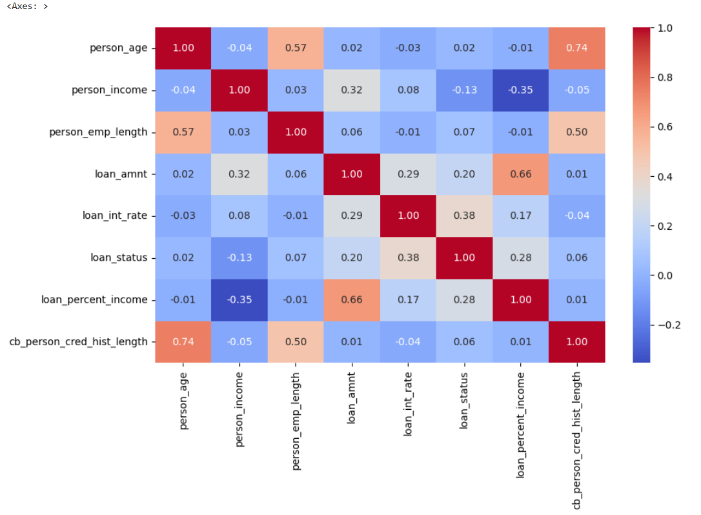
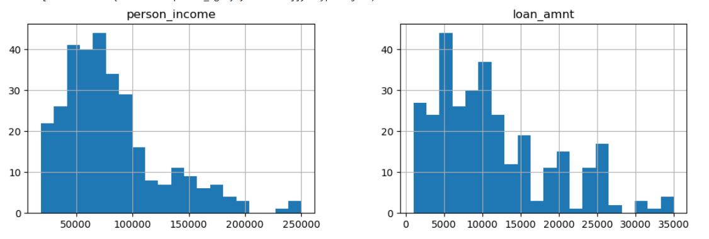
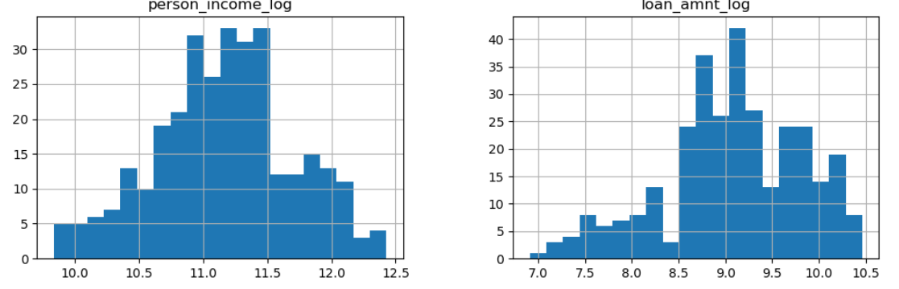

# 🏦 Loan Default Risk Prediction

> **Predicting Loan Defaults Using Machine Learning**  
> An end-to-end Machine Learning pipeline designed to evaluate credit risk and predict loan default probabilities based on applicant demographics, financial profiles, and loan characteristics.

---

## 📌 Table of Contents
- [📂 Project Overview](#-project-overview).
- [📊 Dataset Information](#-dataset-information).
- [📁 Project Structure](#-project-structure).
- [📈 Exploratory Data Analysis (EDA)](#-exploratory-data-analysis-eda).
- [⚙️ Data Preprocessing & Feature Engineering](#️-data-preprocessing--feature-engineering).
- [📝 Model Evaluation](#-Model-Evaluation).
- [🤖 Model Development](#-model-development).
- [📊 Sample Inference Code](#-sample-inference-code).
- [🛠️ Tech Stack](#️-tech-stack).
- [🔚 Conclusion](#-Conclusion).


---

## 📂 Project Overview

Understanding loan default risk is crucial for financial institutions to manage credit risk, minimize financial losses, and optimize lending decisions.

- **Goal:** Predict whether a loan applicant will default on their loan (`DEFAULT / HIGH RISK` vs. `APPROVED / LOW RISK`) and calculate their default probability.
- **Algorithms & Methods:** Machine Learning Classification, Feature Scaling, Logarithmic Transformations, and One-Hot Encoding.
- **Libraries Used:** `pandas`, `numpy`, `matplotlib`, `seaborn`, `scikit-learn`
- **Environment:** Jupyter Notebook / JupyterLab

---

## 📊 Dataset Information

The dataset includes financial, demographic, and historical credit features for each applicant:

| Feature | Description |
| :--- | :--- |
| **person_age** | Age of the applicant |
| **person_income** | Annual income of the applicant |
| **person_home_ownership** | Home ownership status (`RENT`, `OWN`, `MORTGAGE`, `OTHER`) |
| **person_emp_length** | Employment length in years |
| **loan_intent** | Purpose of the loan (`DEBTCONSOLIDATION`, `MEDICAL`, `EDUCATION`, etc.) |
| **loan_grade** | Assigned credit grade (`A`, `B`, `C`, `D`, etc.) |
| **loan_amnt** | Total loan amount requested |
| **loan_int_rate** | Loan interest rate percentage |
| **loan_percent_income** | Loan amount relative to annual income |
| **cb_person_default_on_file** | Historical default on record (`Y` / `N`) |
| **cb_person_cred_hist_length** | Credit history length in years |
| **loan_status** | **Target Variable** (`0` = Approved/Low Risk, `1` = Default/High Risk) |

---

## 📁 Project Structure

├── LoanDefaultRiskPrediction.ipynb   # Main Jupyter Notebook with EDA, preprocessing, and modeling
├── dataset.csv                       # Raw and processed dataset files                       
└──README.md                          # Project documentation                

---

## 📈 Exploratory Data Analysis (EDA)

Before building the predictive model, extensive EDA was conducted to understand feature distributions and correlations:

- **Correlation Heatmap:** Examined numerical relationships between income, loan amount, age, and loan default status.
  
- **Feature Distribution Histograms:** Analyzed skewness across financial features such as `person_income` and `loan_amnt`.
  
- **Key Insights:** Raw income and loan amounts exhibit right-skewed distributions, requiring normalization prior to model training.
  

---

## ⚙️ Data Preprocessing & Feature Engineering

To prepare the dataset for optimal model performance, the following preprocessing steps were applied:

1. **Log Transformations:**
   - Applied `np.log1p` to highly skewed numerical columns (`person_income` $\rightarrow$ `person_income_log`, `loan_amnt` $\rightarrow$ `loan_amnt_log`) to normalize distributions.
   - Dropped original raw income and loan amount columns post-transformation.
2. **Categorical Encoding:**
   - Applied One-Hot Encoding (`pd.get_dummies`) to convert categorical columns (`person_home_ownership`, `loan_intent`, `loan_grade`, `cb_person_default_on_file`) into numerical vectors.
3. **Feature Alignment:**
   - Used column reindexing to guarantee input alignment strictly against training features (`X_train.columns`).
4. **Feature Scaling:**
   - Applied standard scaling (`StandardScaler`) to normalize feature values to zero mean and unit variance.

---

## 🤖 Model Development

1. **Train/Test Split:** Partitioned data into training and testing sets to evaluate unseen risk profiles.
2. **Model Training:** Trained predictive classifiers using standardized applicant features.
3. **Inference Pipeline:** Built a robust input pipeline capable of parsing raw applicant data and predicting risk outcomes.

---

## 📝 Model Evaluation

The model performance was evaluated on the test set using standard classification metrics:

- **Accuracy Score:** **0.86 (86%)**
- **ROC-AUC Score:** **0.9052**

### Classification Report

| Class | Precision | Recall | F1-Score | Support |
| :--- | :---: | :---: | :---: | :---: |
| **0 (Approved / Low Risk)** | 0.98 | 0.84 | 0.91 | 51 |
| **1 (Default / High Risk)** | 0.58 | 0.92 | 0.71 | 12 |
| **Accuracy** | | | **0.86** | **63** |
| **Macro Average** | 0.78 | 0.88 | 0.81 | 63 |
| **Weighted Average** | 0.90 | 0.86 | 0.87 | 63 |

---

### Key Evaluation Takeaways

- **High Recall for High Risk (0.92):** Using `class_weight='balanced'` helped the model successfully identify **92%** of default cases (`Class 1`), minimizing the risk of missing high-risk applicants.
- **Strong Precision for Low Risk (0.98):** **98%** of applicants classified as low risk (`Class 0`) were genuine non-defaulters.
- **Excellent Distinction (ROC-AUC = 0.9052):** Demonstrates strong overall discriminatory capability between default and non-default applicants.

---

## 📊 Sample Inference Code

Below is the implementation used to evaluate new loan applicants using the trained pipeline:

```python
import numpy as np
import pandas as pd

# 1. Define raw applicant input
new_user = pd.DataFrame([{
    'person_age': 35,
    'person_income': 200000,
    'person_home_ownership': 'RENT',
    'person_emp_length': 19.0,
    'loan_intent': 'DEBTCONSOLIDATION',
    'loan_grade': 'C',
    'loan_amnt': 2000,
    'loan_int_rate': 10.68,
    'loan_percent_income': 0.02,
    'cb_person_default_on_file': 'Y',
    'cb_person_cred_hist_length': 3
}])

# 2. Log transformations
new_user_processed = new_user.copy()
new_user_processed['person_income_log'] = np.log1p(new_user_processed['person_income'])
new_user_processed['loan_amnt_log'] = np.log1p(new_user_processed['loan_amnt'])
new_user_processed = new_user_processed.drop(columns=['person_income', 'loan_amnt'])

# 3. Categorical encoding & strict column reindexing
new_user_processed = pd.get_dummies(new_user_processed)
new_user_processed = new_user_processed.reindex(columns=X_train.columns, fill_value=0)

# 4. Feature scaling & probability prediction
new_user_scaled = scaler.transform(new_user_processed)
prediction = model.predict(new_user_scaled)[0]
default_probability = model.predict_proba(new_user_scaled)[0][1]

# 5. Output results
print(f"Loan Decision: {'DEFAULT / HIGH RISK' if prediction == 1 else 'APPROVED / LOW RISK'}")
print(f"Default Probability: {default_probability:.2%}")
```

---

## 🛠️ Tech Stack

- **Language:** Python
- **Data Manipulation & Analysis:** `pandas`, `numpy`
- **Visualization:** `matplotlib`, `seaborn`
- **Machine Learning:** `scikit-learn`
- **Development Environment:** JupyterLab / Jupyter Notebook

---

## 🔚 Conclusion

- **Effective Credit Risk Modeling:** The Logistic Regression model demonstrates strong capability in identifying potential loan defaults, achieving an overall accuracy of **86%** and an impressive **ROC-AUC score of 0.9052**.
- **Minimized Financial Risk:** By utilizing balanced class weighting (`class_weight='balanced'`), the model achieved a **92% recall rate** for high-risk applicants, significantly mitigating financial loss by catching the vast majority of potential default cases.
- **Data-Driven Strategy:** Demographic and financial indicators—specifically income relative to loan amount, credit history length, and loan interest rates—serve as crucial predictive features for financial institutions evaluating borrower risk.
- **Future Improvements:** Future iterations of this pipeline could benefit from exploring non-linear algorithms (such as XGBoost or Random Forests), handling class imbalance via SMOTE, or integrating additional credit bureau data features.


